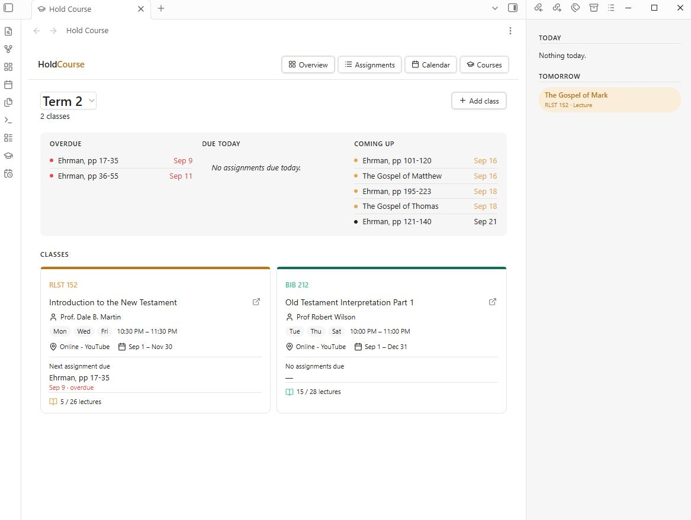
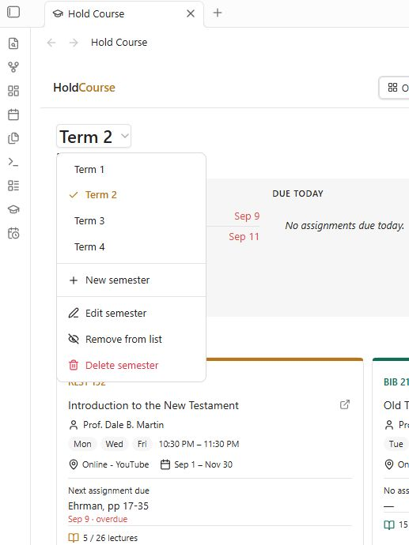
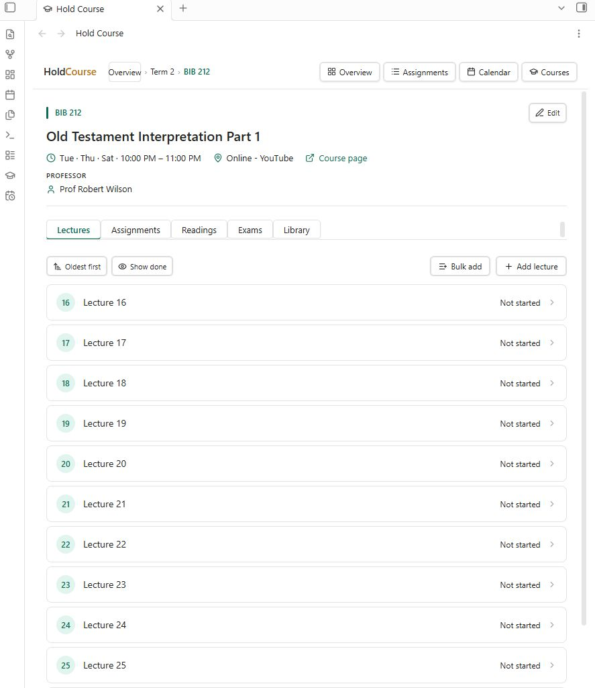
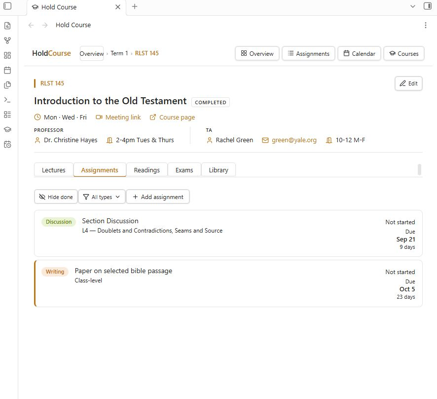
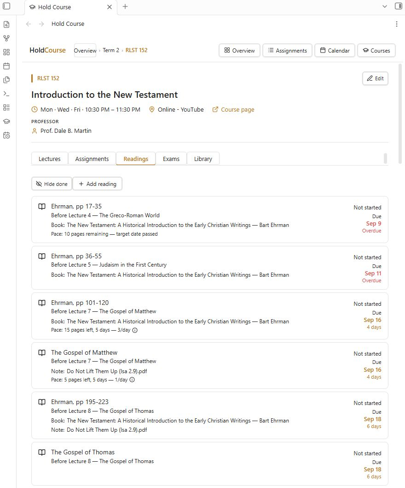
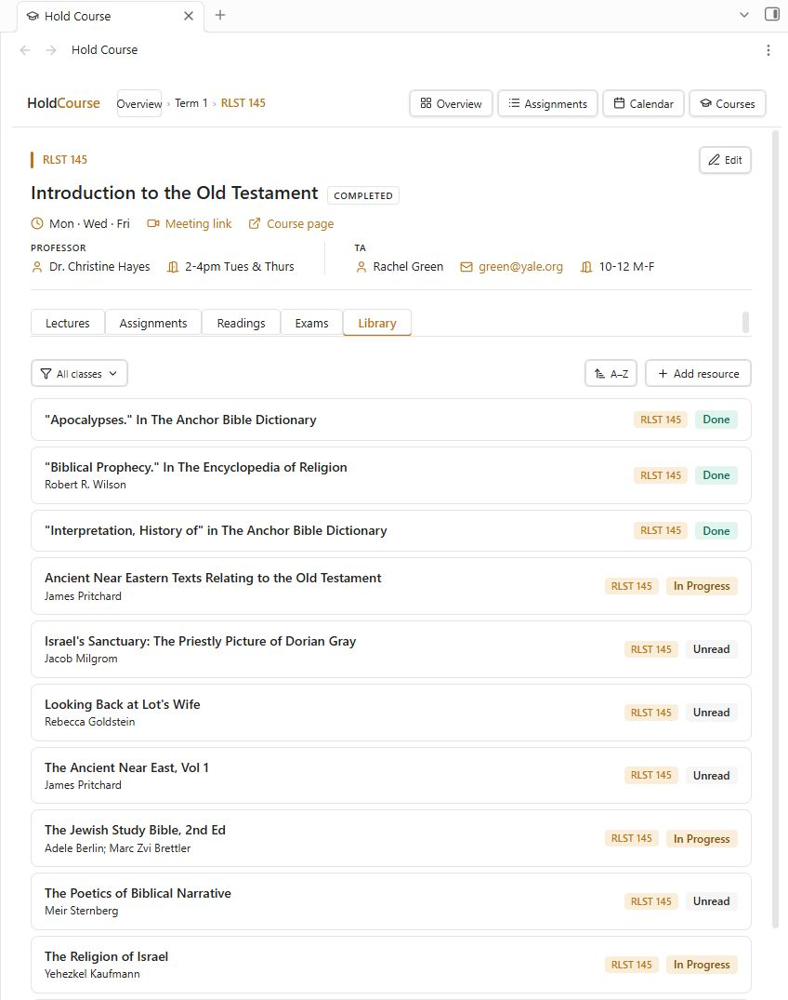
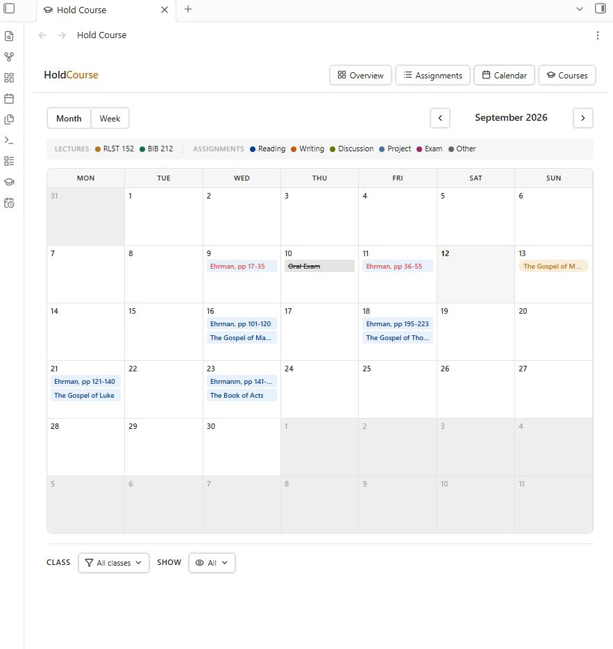
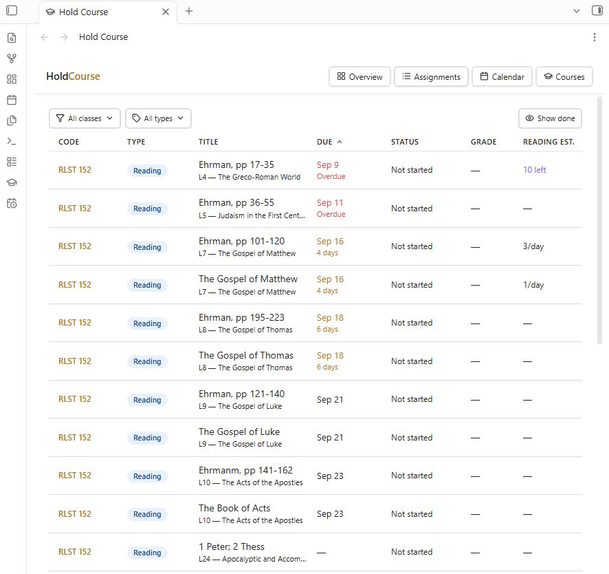
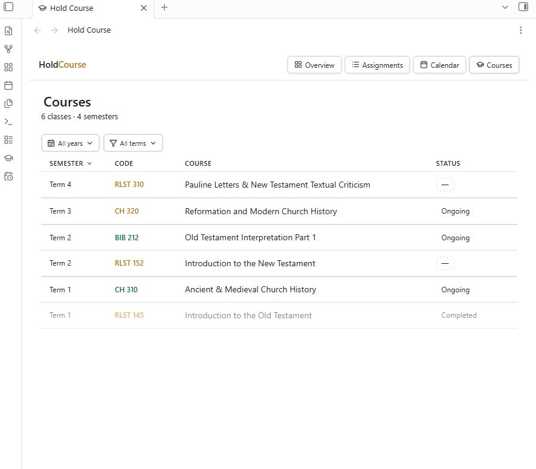
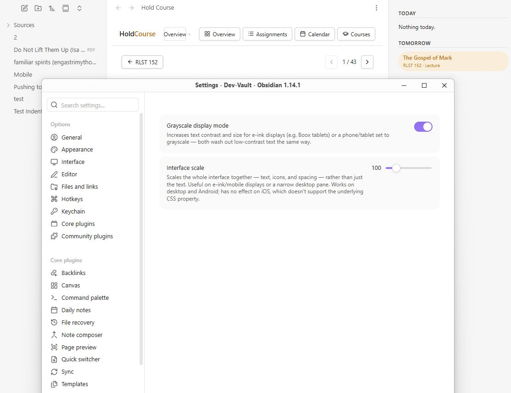

# Hold Course

Always know where you are.

---

Hold Course is an academic tracker for Obsidian. Add your semesters and classes, log your lectures, and track your assignments and exams — all in one place, all in your vault. No syncing, no accounts. Just your courses, clearly laid out.

Hold Course runs on desktop and mobile.

---

## Table of Contents

- [What It Is](#what-it-is)
- [Installation](#installation)
- [Getting Started](#getting-started)
- [Today Strip](#today-strip)
- [Semesters](#semesters)
- [Classes](#classes)
- [Moving a Class](#moving-a-class)
- [Lectures](#lectures)
- [Assignments](#assignments)
- [Readings](#readings)
- [Exams](#exams)
- [Library](#library)
- [Calendar View](#calendar-view)
- [Assignments View](#assignments-view)
- [Courses](#courses)
- [HC Today Sidebar](#hc-today-sidebar)
- [Command Palette Shortcuts](#command-palette-shortcuts)
- [Linked Notes](#linked-notes)
- [Settings](#settings)
- [Mobile](#mobile)
- [Data Storage](#data-storage)

---

## What It Is

Hold Course grew out of a simple frustration: syllabi don't fit cleanly into task lists. I'm a self-learner, working through courses and curricula on my own schedule, and what started as a manageable system of lists eventually became its own job — tracking lectures, chasing readings, and trying to remember what connected to what. Hold Course is what I personally needed: an academic tracker that lives inside my vault, where my notes and resources are a click away instead of scattered somewhere else entirely.

Hold Course is built around a simple premise: you should always know exactly where you are in a course — which lectures you've attended, which assignments are coming, and what needs your attention today. It tells you where things stand. The rest is up to you.

Classes are organized into **semesters**. Each class holds its own **lectures**, **assignments**, **exams**, and a **library** of resources referenced across your coursework. You advance items through their status as you go, and optionally link anything to notes in your vault. The plugin tracks the rest.

---

## Installation

Search for **Hold Course** in Obsidian's community plugin browser (*Settings > Community plugins > Browse*), install, and enable it. The plugin adds a **Hold Course** icon to your left ribbon.

---

## Getting Started

Click the Hold Course ribbon icon to open the plugin. It opens as a full-width tab.

On first launch you'll see the **Overview** — an empty workspace. Here's the typical setup flow for a new semester:

1. **Create a semester** using the semester dropdown at the top of the Overview.
2. **Add your classes** to the semester — one for each course you're taking.
3. **Open a class** and start adding lectures. You can add all your lectures up front and fill in assignments later, or build them out together as you work through the syllabus — whichever fits how you read a course schedule.
4. **Add exams** on the Exams tab for any high-stakes dates you need to track separately.
5. **Add resources** to the Library as you encounter them, or quick-add them from within a lecture or assignment and fill in the details later.

From there, it's a matter of advancing item statuses as the semester moves until finally you end with this:

---

## Today Strip

The Overview opens with a strip summarizing what needs attention right now, drawn from assignments across every class in the active semester.

**Overdue:** Any assignment past its due date and not marked done, oldest first. This column only appears when something is actually overdue — no overdue work, no column.

**Due Today:** Assignments due today.

**Coming Up:** The next several assignments due after today, soonest first.

Click any item in the strip to jump straight to its detail screen.

---

## Semesters

The semester dropdown at the top of the Overview lets you switch between semesters or create a new one. Only one semester is active at a time, but your data from previous semesters stays in place. Semesters are listed oldest to newest by term and year, not by the order you created them.

**Creating a semester:** Open the dropdown and click **+ New Semester**.

**Switching semesters:** Select any semester from the dropdown.

**Renaming a semester:** Open the dropdown and select **Rename Semester**.

**Removing a semester from the list:** Open the dropdown and select **Remove from list**. This clears the semester out of the dropdown so old terms don't pile up — it doesn't delete anything. Every class, lecture, assignment, and resource stays exactly where it was. Only appears when more than one semester is visible.

**Restoring a removed semester:** Open the dropdown and select **Show removed semesters**, then choose the one you want back. Restoring a semester also switches you to it. Only appears when at least one semester is removed.

**Deleting a semester:** Open the dropdown and select **Delete Semester**. Since this removes every class, lecture, assignment, exam, and library resource under that semester, the confirmation dialog states exactly how much is about to be deleted. This cannot be undone.

---

## Classes

Inside a semester, each class appears as a card on the Overview showing the class name, course code, and instructor.

**Adding a class:** Click **+ Add Class** to open the Add Class dialog, organized into three tabs so the form never requires scrolling to find Save:

- **Details** — class name, class code, course page URL, track grades
- **People** — professor name and email, office hours, TA name and email and office hours
- **Schedule** — meeting days, location, start/end date, start/end time, and a meeting link

Only the class name is required; fill in the rest as you have it.

**Opening a class:** Click the class card. Each class has five tabs: **Lectures**, **Assignments**, **Readings**, **Exams**, and **Library**.

**Editing or deleting a class:** On the dashboard, hovering near the top right of a class card reveals a menu to **Edit class** and **Delete class**. A class can also be edited from the **Edit** button in its detail screen — editing uses the same Details/People/Schedule tabs as adding a class.

**Class schedule:** When a class has meeting days, a start and end time, and a start and end date all set, Hold Course knows exactly when that class meets. Log a lecture on a day that matches, and its meeting time is shown automatically — no need to re-enter it per lecture. Leave any one of those fields blank and nothing changes: this is entirely opt-in, and existing classes are unaffected until you fill them in. Times are entered with a custom picker — hour and minute dropdowns with an AM/PM toggle — to match the rest of the plugin.

**Lecture progress:** Once you've marked at least one lecture done, the class card shows a progress fraction — lectures completed out of total logged.

**Next up:** A class with no meeting days and no dates set anywhere — no lecture, assignment, or exam dates — shows a **Next up** section on its card instead of a permanently empty "No assignments due" line. It points to the next lecture you haven't finished, plus any unread reading tied to it. Classes with a real schedule or any due dates are unaffected; this only applies to fully self-paced work.

**Professor email:** If an email address is saved to the class, it appears as a clickable link that opens your operating system's default mail client.

> **Note:** The professor email link requires a default mail client configured on your system (such as Mail on macOS or Outlook on Windows). If no default mail client is set, the link may not open.

**Course page URL:** If a URL is saved to the class, it appears as a quiet external-link icon next to the class name on the dashboard card, and as a "Course page" link in the class header. Useful for linking to a course portal, Coursera page, or syllabus hosted online.

**Meeting link:** A recurring meeting link — Zoom or similar — kept separate from the course page URL, since a course portal and a place to join class are different things. It appears in the class header next to the meeting days, because when class happens and how you get there is really one question.

**Meeting time, location, and date range on the card:** When a class has meeting days set, they appear as day chips on the class card. If a start and end time are also set, the meeting time shows inline with the chips, no extra height added. Location and date range appear as a separate row on the card, but only when at least one of them is set — useful for a partial-term class or telling an in-person class from an online one at a glance.

**Office hours and TA:** A class can record office hours for the professor, and a name, email, and office hours for a teaching assistant. The class header shows the professor and the TA side by side as labeled blocks of equal weight, with a divider between them.

All of this is optional, and nothing is drawn until it has content. A person appears once any one of their fields is filled in. The TA block is absent entirely until it has something to show. The divider appears only when there are two blocks to divide. A class with nothing but a name shows a header with nothing but a name.

---

## Moving a Class

A class can move to a different semester without losing anything logged under it — lectures, assignments, exams, contacts, and notes all travel with it.

This is most useful if you're building your own curriculum across terms — a class you planned yourself gets pushed to a later term instead of dropped, and everything already typed into it needs to survive the move. If you're taking classes on a school's own semester schedule, you likely won't need this.

**Moving a class:** Right-click a class in the Courses view, or open its card menu on the Overview and select **Move to semester**. Choose a target semester and confirm.

**Resources:** A resource used only by the moving class moves with it. A resource shared with other classes staying behind is copied instead, so the classes that stay keep their copy and nothing breaks on either side.

> **Note:** A class can move out of a removed semester, but not into one. Restore the semester first if you want to move a class there.

---

## Lectures

Inside a class, the **Lectures** tab lists all logged lectures in order.

**Adding a lecture:** Click **+ Add Lecture** and fill in the title and date.

**Bulk adding lectures:** Click **Bulk add** to open a paste box for entering a whole schedule at once — one lecture per line.

Dates can be filled in for you. Pick the first day of class, confirm the meeting days, and dates walk the calendar from there, one lecture per meeting. A blank line skips a meeting, which is how you handle a reading week or a holiday. A date at the end of a line marks that lecture as an out-of-band session — a guest lecture or a makeup — placing it on that date without consuming a meeting slot. ISO (`2026-08-24`), `Aug 24` / `24 Aug`, and numeric (`8/24`) formats are all accepted.

A live preview shows every parsed lecture and the date it will land on before anything is added. Short titles are highlighted for a second look, since a pasted line break can quietly split one lecture into two. A bulk add can't be undone in a single step, so the preview is worth reading.

**Status:** Each lecture has a status pill that cycles through **Not Started / In Progress / Done**. Click the pill — from the list or the detail screen — to advance it. Done lectures appear with muted styling — present in the record, but visually stepped back so your attention goes to what's ahead. Completed lectures can be hidden completely by using the **Show done/Hide done** toggle.

**Sort order:** Use the sort toggle to switch between oldest-first and newest-first.

**Lecture detail:** Click a lecture to open its detail screen, where you can edit its fields, jot key concepts and lesson goals, link the lecture to a note in your vault, and see every assignment attached to it. Assignments can be added here one at a time or in bulk.

---

---

## Assignments

Inside a class, the **Assignments** tab lists all logged assignments.

**Adding an assignment:** Click **+ Add Assignment** and fill in the title, due date, type, and any other details.

**Bulk adding assignments:** Open a lecture and click **Bulk add** in its Assignments section. One assignment per line — each becomes an assignment attached to that lecture and inherits the lecture's date as its due date. One type applies to the whole batch, so paste one kind at a time. A live preview shows every assignment before anything is added, and the same caution applies: check the rows, because a bulk add can't be undone in a single step.

**Assignment types:** Each assignment has a type — Reading, Writing, Project, Discussion, or Other — color-coded throughout the plugin so you can scan quickly.

**Grade:** Assignments have an optional grade field. Fill it in after graded work is returned. Once an assignment is marked done, a recorded grade appears as a quiet pill next to its title in every list view. Grade doesn't apply to Readings, so the field is never shown there. You can also turn grading off entirely for a class — see the Track grades toggle under Classes — which hides the Grade field and chip everywhere for that class, useful for self-study or audited classes with no assigned grades.

**Filtering:** Use the **All types** dropdown to show only one kind of assignment. The **Show done/Hide Done** toggle works alongside the filter — they stack.

**Status:** Each assignment has a status pill that cycles through **Not Started/In Progress/Done**. Click the pill — from any list or the detail screen — to advance it. Done assignments appear with muted styling across all views. Completed assignments can be hidden completely by using the **Show done/Hide done** toggle. 

**Term-window flag:** If an assignment or exam falls outside its class's own start and end dates, a small warning icon appears next to its title. It catches a due date that's drifted outside the term without you having to cross-check dates by hand. The icon only appears once a class has both dates set on its Schedule tab, and clears on its own once the item is marked done.

**Assignment detail:** Click an assignment to open its detail screen, where you can edit all fields, link the assignment to a note in your vault, or quick-add a resource to the Library.

---

## Readings

Inside a class, the **Readings** tab lists everything assigned as reading — pulled out of Assignments into its own view, since a reading is prep tied to a lecture rather than graded, deadline-driven work.

**Adding a reading:** Click **+ Add Reading**. Since this tab is reading-only, there's no type to choose — it's locked in for you.

**Context:** Each reading shows either **Class-level** or the lecture it's attached to (**Before Lecture 3 — Cell Structure**, for example), so you know what it's tied to at a glance.

**Linked Book:** Link a reading directly to a resource in the Library to see its title and author right on the row. Unlinked readings show **No linked book**.

**Status and due date:** Readings use the same **Not Started / In Progress / Done** status pill and due-date display as Assignments. Use the **Show done/Hide done** toggle to declutter a finished reading list.

Readings never show a grade field or grade chip — grading doesn't apply to them.

### Reading pace

Turn on **Track pace for this reading** on a reading and Hold Course will
work out how many pages a day it takes to finish on time. It asks two
things: how many pages in total, and by what date (defaults to the due
date).

**The page count is whatever you say it is.** Hold Course never looks at how
long a book is or how many pages a linked note has — it only knows the
number you typed. If a 400-page book is assigned but you only need chapters
4–7, enter the pages for chapters 4–7. If a reading spans two books and a
PDF, add them up and enter one number.

**Logging works the same way.** Open **Log progress** and enter your running
total in **Pages read so far**. Hold Course doesn't track which book or file
those pages came from — 20 pages of one and 10 of another is just 30. Use
**Edit setup** on that same dialog to change the total or the target date
later.

**The number moves in two directions.** It isn't a record of what you were
supposed to do today; it's recalculated every time from what's left and how
long you have — pages remaining divided by days remaining, counting today.
So **logging pages lowers it, and a day passing raises it.** Say you have 20
pages to read over five days:

| | Shows |
|---|---|
| Starting out | `20 pages left, 5 days — 4/day` |
| You log 1 page | `19 pages left, 5 days — 3.8/day` |
| Next day, nothing logged | `19 pages left, 4 days — 4.8/day` |
| You log 10 more | `9 pages left, 3 days — 3/day` |

Reading one page on day one doesn't make the number jump — you still have
the rest of the day. Falling behind shows up the next morning, when the
days-remaining figure drops and the pace rises to match. Both numbers are on
the line so you can see which one moved.

The pace figure also appears as its own column in the cross-class
[Assignments view](#assignments-view).

---

## Exams

Inside a class, the **Exams** tab lists scheduled exams with their dates and a live countdown to each one.

**Adding an exam:** Click **+ Add Exam** and fill in the name and date.

**Countdowns:** Each exam shows how many days away it is, updated automatically.

**Status:** Exams are a simple done / not done toggle — click the status control on the exam row, or open the detail screen and use the Mark done button. A recorded grade appears as a quiet pill on done exams. Done exams can be hidden using the **Show done/Hide done** toggle on the Exams tab.

Exams appear on the Calendar in their own color, distinct from lectures and assignments.

---

## Library

The **Library** tab collects every resource associated with a class — books, articles, reference works — into a single list. Resources accumulate here as you add them, and each one tracks which lectures and assignments reference it.

**Adding a resource:** Click **+ Add Resource** to add a resource directly to the Library. Resource types include Book, PDF, Handout, Article, Online resource, and Other.

**Filter by class:** The Library has an *All classes* filter, so you can view resources from a single class or across all your classes at once.

**Status:** Each resource has a status pill — **Unread**, **In Progress**, or **Done** — that you can advance as you read.

**Linked Book:** Reading assignments can be linked directly to a resource in the Library. For all other assignment types, a Linked Note field is available instead. Both are set from the assignment's detail screen.

**Resource detail:** Click any resource to see everything associated with it: the classes it belongs to, its type, and every lecture and assignment that references it — each one clickable through to the item itself.

---

## Calendar View

The **Calendar** shows all your lectures, assignments, and exams across all classes in one view.

**Week and month modes:** Switch between views using the toggle in the upper left.

**Legend:** The top of the calendar shows a color key — lectures listed by class, assignments listed by type (Reading, Writing, Discussion, Project, Exam, Other). Exams from the Exams tab appear in their own color.

**Class filter:** Use the **All classes** dropdown at the bottom to narrow the calendar to a single class.

**Show filter:** Narrow the calendar by item kind — **All**, **Lectures**, **Assignments**, or **Exams**.

**Type filter:** Appears once the Show filter is narrowed to Assignments, letting you further narrow to a single assignment type (Reading, Writing, Project, Discussion, Other).

**Meeting time on lecture entries:** When a class's schedule fields are filled in (meeting days, start/end time, start/end date) and a lecture falls on a matching day, the calendar shows that meeting time directly on the lecture entry in both week and month view.

**Day detail:** Click any day to open a popover listing every item scheduled for that date, each labeled with its type and class. Click any item in the popover to view its full detail screen.

Done items appear with strikethrough and muted styling in both the calendar and the day detail popover.

---

## Assignments View

The **Assignments** button in the toolbar opens a cross-class view of every assignment in the current semester — all classes combined in one sortable table.

The table has seven columns: class code, type, title, due date, status, grade, and reading pace. Empty cells show a dash.

**Sorting:** Click a column heading to sort by it; click again to reverse.

**Filtering:** Use the class filter to narrow to a single class, and the type filter to show only one assignment type. Both filters stack, and the **Show done** toggle works alongside them.

Click any assignment to open its detail screen.

Inside a class, assignments still appear as cards — this table is only the global view, where seeing everything side by side is the point. On a narrow screen the table scrolls sideways rather than dropping columns, so nothing is hidden.

---

## Courses

The **Courses** button in the toolbar opens a cross-semester view of every class you've logged, in one table — a record of what you've taken alongside what you're taking now, rather than a working view of the current term. The header shows the totals: how many classes across how many semesters.

Columns are semester, course code, course name, and status.

**Filtering:** The **All years** and **All terms** dropdowns narrow the list. Both stack.

**Sorting:** Click any column heading to sort by it; click again to reverse.

**Status:** Each class can be marked **Ongoing**, **Completed**, or **Dropped**. Click the status cell to set it. A dash means no status is set yet — status is optional, and a class works exactly the same without one. Completed and dropped classes appear muted, so finished work steps back and current work stays prominent.

Click any row to open that class's Lectures tab. Right-clicking a class here is also how you [move it to a different semester](#moving-a-class).

---

## HC Today Sidebar

Hold Course adds an **HC Today** panel to Obsidian's right sidebar. It shows everything due or happening today and tomorrow — lectures, assignments, and exams, all classes combined.

Each item shows its title and a subtitle line with the class name and item type. Lectures are color-coded by class; assignments are color-coded by type — the same system used throughout the plugin. Items you've marked done appear with strikethrough and muted gray styling so finished work recedes and what's still ahead stays visible.

**Opening:** The sidebar opens automatically when the plugin loads. Use the command palette to reopen the sidebar if necessary. 

**Navigating:** Click any item to open the main Hold Course tab and navigate directly to that item's detail screen.

**Auto-refresh:** The sidebar updates automatically whenever you make a change in Hold Course, and again on its own if the date rolls over while Obsidian is left open — so Today and Tomorrow stay accurate even overnight. You don't need to refresh it manually.

---

## Command Palette Shortcuts

Hold Course registers several commands in Obsidian's command palette (Ctrl/Cmd+P) for quick access without opening the plugin first:

- Open Hold Course — opens the main tab
- Open Hold Course — Today — opens the Today sidebar
- Add a class — opens the Add Class dialog for the active semester
- Open calendar — opens the main tab and navigates directly to Calendar view
- Show global assignments — opens the main tab and navigates to the Assignments view
- Add a library resource — opens the Add Resource dialog for the active semester
- Add a lecture — opens the Add Lecture dialog for the current class (requires an open class screen)
- Add an assignment — opens the Add Assignment dialog for the current class (requires an open class screen)
- Export Hold Course data snapshot — copies `data.json` to a timestamped backup file in the plugin folder

All commands are hotkey-bindable via Settings > Hotkeys.

---

## Linked Notes

Any lecture, assignment, or exam can be linked to an existing note in your vault. Set the link from the item's detail screen. Linked notes open directly from the detail screen.

---

## Settings

Hold Course's settings are under *Settings > Community plugins > Hold Course*.

**Interface scale** — a slider from 90% to 150%, in 10% steps. It scales the whole interface together — text, icons, and spacing — rather than just enlarging the type, which is what makes it useful on an e-ink tablet or in a narrow pane. Above 100% some control rows scroll sideways rather than shrink; a phone screen only fits so much, and scrolling keeps everything reachable instead of clipping it.

This works on desktop and Android. It has no effect on iOS, which doesn't support the underlying CSS property — the setting is simply inert there rather than broken.

**E-ink display mode** — adjusts contrast and removes transitions for slow-refresh displays. Off by default; it isn't detected automatically, since the CSS feature meant to detect e-ink displays isn't implemented in the browser engine Obsidian uses.

---

## Mobile

Hold Course runs on Obsidian Mobile. Every screen and form works on a phone, with layouts adjusted where the desktop arrangement didn't survive the narrower width — forms stack rather than crowd, wide tables scroll sideways rather than drop columns, and rows that can't fit on one line wrap instead of truncating.

A few things work differently by necessity:

- **Card menus are always visible.** On desktop, the Edit/Move/Delete menu on a class card appears on hover. A finger can't hover, so on mobile the menu is simply always shown.
- **Modals can't be dragged on a phone.** The drag bar is hidden there, since a phone modal is effectively full-screen and has nowhere to move to. Tablets keep it.
- **Interface scale** is worth a look on mobile — see [Settings](#settings).

---

## Data Storage

All plugin data is stored in `data.json` inside the Hold Course plugin folder. This file is created automatically on first use and holds all your semesters, classes, lectures, assignments, exams, and library resources. Back it up along with your vault.

The **Export Hold Course data snapshot** command copies `data.json` to a timestamped file in the same folder (`hold-course-backup-2026-09-08-14-30-22.json`) — a one-click version of that backup. Every run makes a new file and nothing is ever overwritten or pruned, so clearing out old snapshots is up to you.

---

*Hold Course is a community plugin for Obsidian. Feedback and bug reports are welcome via the GitHub repository. Thanks to [@fastermadman](https://github.com/fastermadman) for testing on e-ink devices, reporting, and working on some of the issues that shaped mobile support.*

